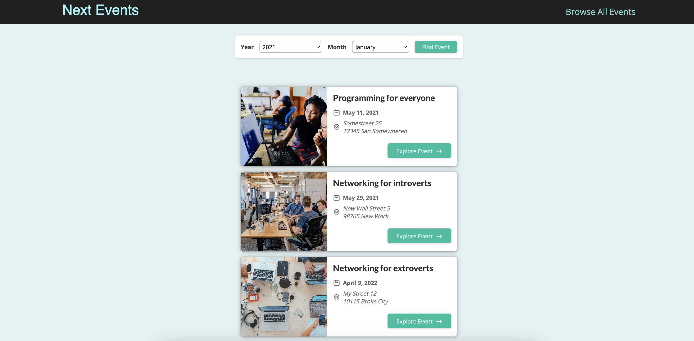

### Performance Dashboard being developed for measuring UI performance for specific URLS
* Using ```DOM Performance API```
* ```Local stack``` is being leveraged for AWS API Mocking for DynamoDB
* Benchmarking the numbers with different tools such as ```Google lighthouse```

* project starter commands
    * ```npx create-next-app@latest```

<hr />
 This repo has some sample projects developed as part of learning
 
#### App 01

